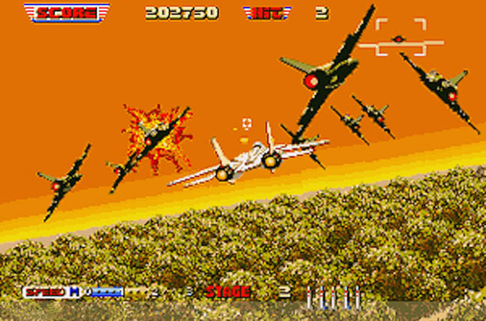

### Premise

2d top down (or isometric) ace combat like arcade dogfight shooter

fight horrors from another dimension due to reckless greed fueled experimentation form \[corporation or government]

### Aesthetic

I enjoy shoot em ups like Bytepath but feel restricted by the locked screen view

Like afterBurner but more top down or isometric and restricted to one horizontal plane of action. No pitch, only yaw

I like the mini map and weapons display in ace combat
 

Like aerofighters in terms of graphical complexity but with the ability to turn and fly around a map instead of being locked into a single directional scroller

I like the pseudo 3d flight in Dragonball Z: Leagacy of Goku 2. Maybe with the camera angled down more so that the horizon isnt shown. Replace Piccolo with a fighter jet, throw in some things to shoot at, and mountains/buildings/enemies to crash into then we'll have exactly what im looking for 

### Themes

what ideas can I convey in a 2d airplane shooter?

- quality over quantity 
- anti corprate 

super natural aspects?

arcade?

military?

retro?

### Features:
	
- weapons: guns, missiles, bombs
	- limited weapon range
	- stretch: elemental types with resistance/effectiveness?
- defense: spin to reflect projectiles, if spin too much get dizzy and  controls randomized temporarily 
- projectiles have travel time, need to lead shots
	- stretch: indicator on where to lead your shots boased on current velocity like in ace combat
- objectives: defend ground allies, destroy targets
- stretch: levels, buy upgrades to plane between levels
- win condition: kill all enemies, complete all objectives
- lose condition: get shot down, fail objective
- stretch: multi player. Co op, Vs
 
### Name Ideas:

Aileron (I like this one)

Dogfight Skywar Ace

### Mechanics
#### Controls
wasd to turn, accelerate, decelerate

shift, space, ctrl, alt to shoot, use missiles, bomb 

arrow keys, ijkl to shift camera around
#### View

"chessboard on a lazy susan"

## Unity engine

Linux, windows, mac platforms

2d or 3d engine locked in plane?

Maybe 3d voxel planes with 2.5d sprite environment 

assets available for both. more for 3d

2d sprites easier to make 
### 2d
16 bit graphics

- commission sister?
- isometric
	- "paper cutouts" to show parallax
	- kinda like paper Mario
	- have left, right, front, back views of sprites?
- top down
	- difficult to show what you could crash into
	- outline everything player can crash into in red?

### 3d

- found low poly space ship pack
- use 3d models but lock everything into "plane of action" added complexity?
- potential for non-euclidean levels. inside / outside of sphere. over scope?