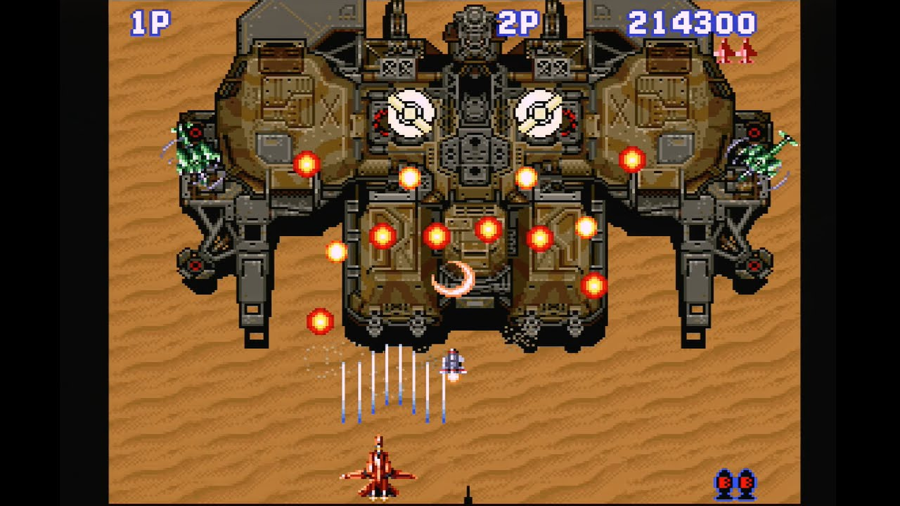
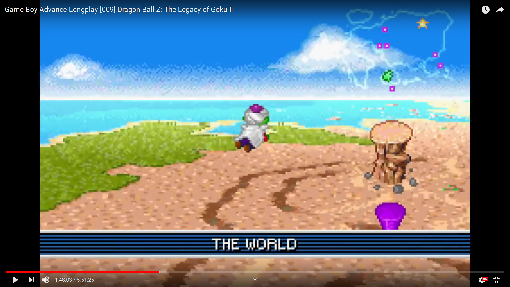
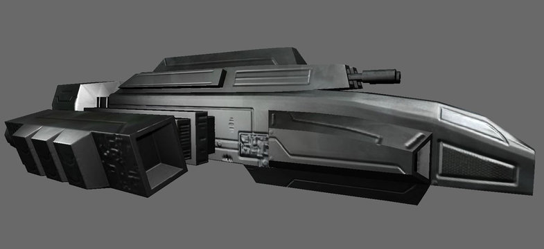
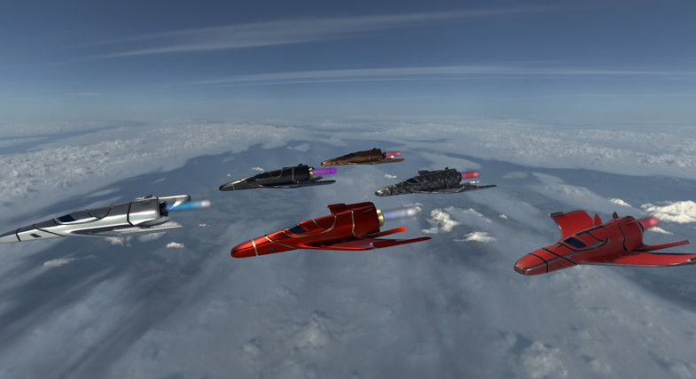
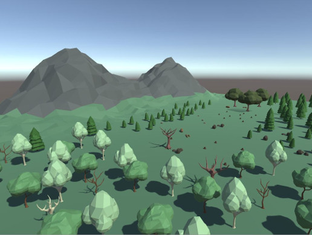
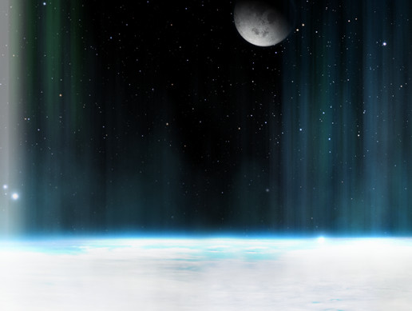
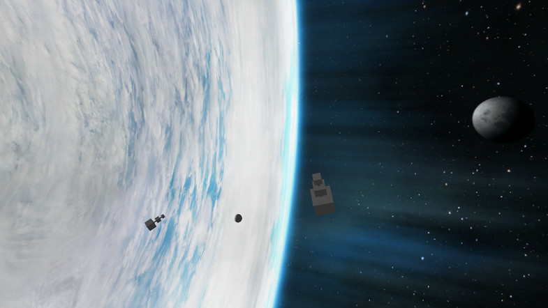
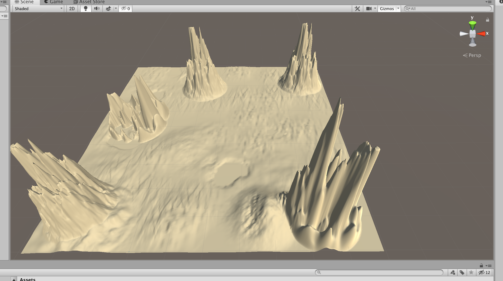
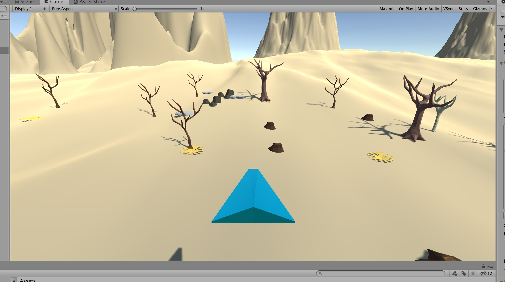
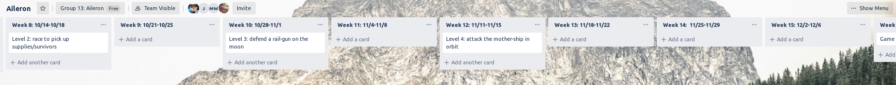

# Team 13: Aileron Proposal 

Blog site: https://aileron742638168.wordpress.com/?frame-nonce=a4b5edb8f5

## Overview

Ale-er-on

"Ace Combat meets Galaga"

I like the mini map and weapons display in ace combat
 

Like aerofighters in terms of graphical complexity but with the ability to turn and fly around a map instead of being locked into a single directional scroller
 

I like the pseudo 3d flight in Dragonball Z: Leagacy of Goku 2. Maybe with the camera angled down more so that the horizon isnt shown. Replace Piccolo with a fighter jet, throw in some things to shoot at, and add mountains/buildings/enemies to crash into then we'll have exactly what im looking for 

Progress as of 9/16/2019

#### Narrative arc

4 levels

1: Defend allies from attacking aliens

2: Race to extract evacuating civilians 

3: Defend the railgun on the Moon

4: Attack alien mothership 

#### Style/theme
* sci-fi
* militaristic
* low poly no/minimal texture
* horrors from another dimension

## Platforms

PC: Windows, Linux, Mac

Game Controls: Regular arrow keys, WASD and game controller.

## Plan for art and audio content for the game

Unity store, YouTube, https://opengameart.org/

 

 

Here is what we currently have for our desert scene.

* Synthesizer heavy soundtracks. 
* Repetitive synthesizers for battle music (du du du, wa wa wa).
* Dirty synths that slap hard for boss music.

## Division of labor

### Enemies

* giant ground insect? (jordan)
	* behavior [AI] 
	* attack
	* movement
	* model
	* animation

* flying (ross)
	* behavior [AI] 
	* attack
	* movement
	* animation
	* model
	
### Friends
 
* moon railgun
	* behavior [AI] 
	* attack
	* movement
	* animation
	* model
* tanks
	* behavior [AI] 
	* attack
	* movement
	* animation
	* model
	
### Player Ship

* 3d model (ross)
* movement (ross) 
* Weapons 
	* gun (jordan)
	* bomb
	* railgun
	* missile
* effects (jordan) 
* collision (ross)
	* subtract hp on collision

### Level design

* objectives (morgan)
	* level 1
	* level 2
	* level 3
	* level 4
* environment (morgan)
	* city
	* forest
	* moon
	* orbit

### Story (zach)

* Characters
* narration
* plot

### Progression

* weapon unlocks (Jordan)

### hud/ui
* weapon aim reticle
* objective markers

### Misc

* power ups
* menu
	* pause
	* save
	* quit
* lighting
* Mini map (Zach)

## Schedule

 

## First playable commitments 

* 1 level
* 2 enemy types
* 1 weapon type
* 1 Boss
* 1 Ally type
* 1 building
* 1 Environmental hazard
* 1 song
* Player ship modeled 
* 3 sound effects
* 1 Big Boss soundtrack
* Controller support
* Player movement
* Win/Loss state (1 Objective)
